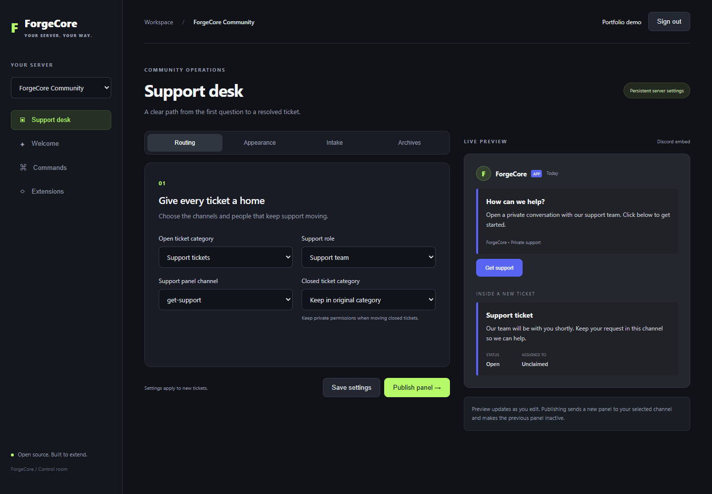
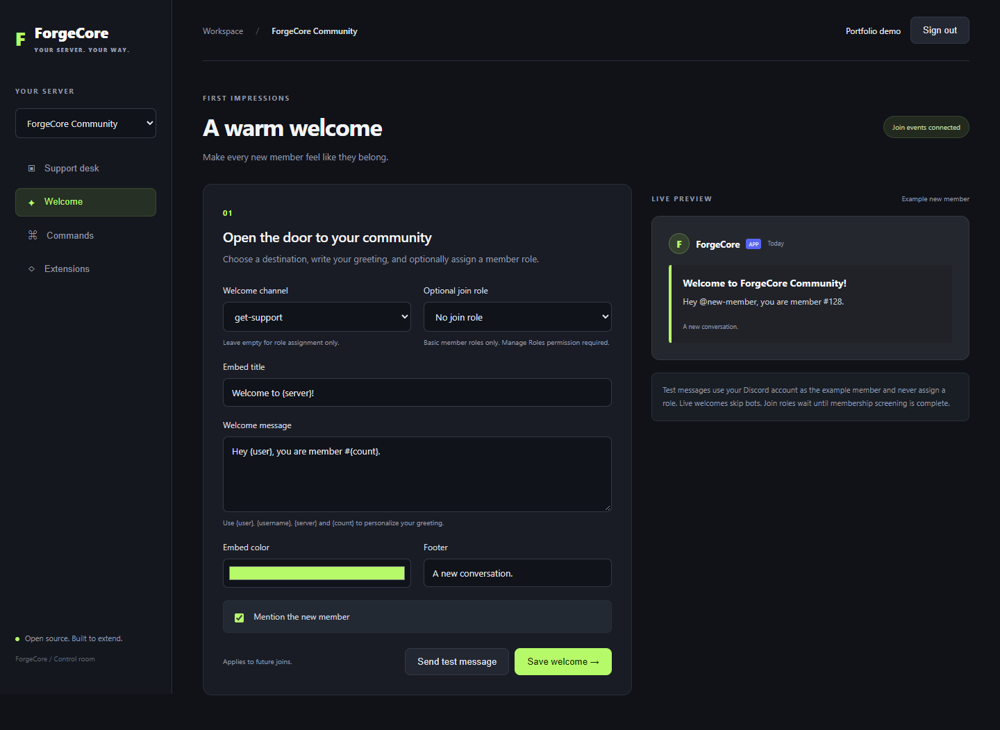
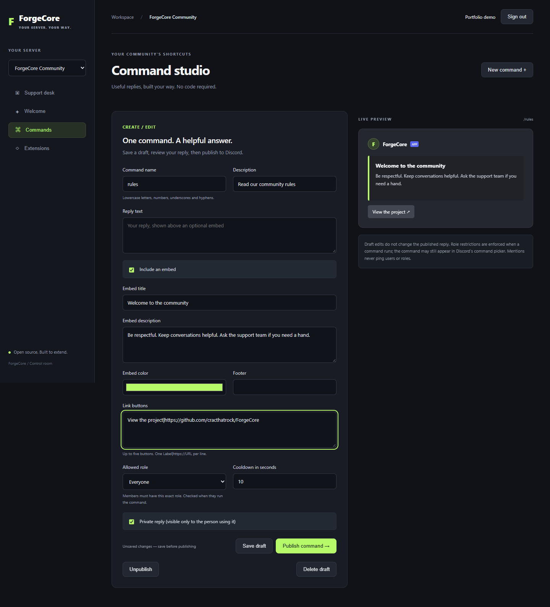
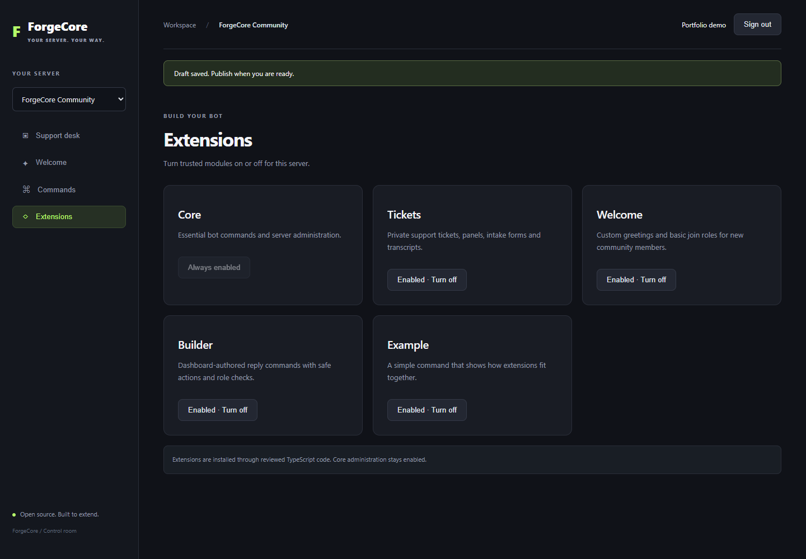

# ForgeCore feature gallery

One bot, a configurable dashboard, and server-owned settings that persist across restarts. These screenshots use isolated example data in the real dashboard UI; they are not screenshots of customer servers.

## Support desk

Choose routing and staff roles, customize embeds, collect intake answers and save transcripts in a private archive. Closed-ticket routing and confirmed deletion complete the support flow.

## Welcome messages

Create a greeting using member/server placeholders, select a welcome channel and optionally assign a basic member role. A live preview and test-message action help check the result.

## Command studio

Build helpful slash commands with text, embeds and HTTPS link buttons. Save drafts independently from the active reply, then publish when ready. Role restrictions and cooldowns are checked at runtime.

## Extension controls

Enable or disable modules per server. Developers add trusted TypeScript extensions through the explicit registry; the dashboard builder does not execute arbitrary code.

## What this project demonstrates

- Discord bot and web dashboard integration using the same persistent settings.
- OAuth login, server authorization checks and CSRF-protected saves.
- Configurable workflows with previews and validated Discord actions.
- TypeScript modules, documented setup and meaningful automated checks.

The [README](../README.md) explains setup, runtime permissions and the practical limits. The [demo guide](DEMO.md) walks through recording a live development-server demonstration.
